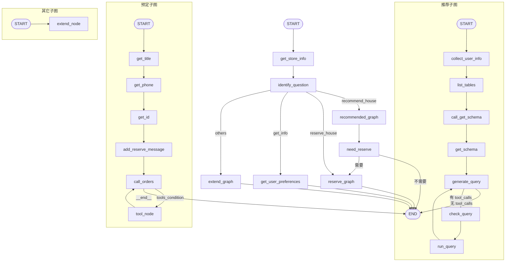

# 🏠 House Agent — 智能租房助手

基于 [LangGraph](https://github.com/langchain-ai/langgraph) 构建的多智能体（Multi-Agent）租房助手应用。通过自然语言对话，帮助用户**推荐房源**、**预定房源**、**查询偏好**，支持人在回路（Human-in-the-loop）交互与用户偏好持久化存储。

## ✨ 核心功能

| 功能 | 说明 |
|---|---|
| 🧠 **意图识别** | LLM 自动判断用户是想推荐、预定、查询偏好还是其它问题 |
| 🏘️ **智能推荐** | 根据城市、预算、户型、朝向等条件，从 MySQL 数据库自动生成 SQL 并查询匹配房源 |
| 📅 **预定房源** | 通过多轮中断交互收集房源标题、电话、身份证，自动生成预定工单并持久化 |
| 👤 **偏好查询** | 查询用户历史偏好（预算范围、已预定记录）并生动回复 |
| 💾 **偏好持久化** | 利用 LangGraph Store 持久化用户预算和预定记录，后续对话自动加载 |
| ⏸️ **人在回路** | 关键信息缺失时通过 `interrupt()` 暂停等待用户补充输入 |
| 🌐 **Web 聊天界面** | 提供 `static/house.html` 前端，支持 SSE 流式响应与思考过程可视化 |

## 🏗️ 架构概览

项目由 **4 个 LangGraph 图（Graph）** 组成，主图负责路由分发，子图负责具体业务：

```
                     ┌─────────────────────────┐
                     │      Main Graph          │
                     │   (graph.py: graph)      │
                     └───────────┬─────────────┘
                                 │
              ┌──────────────────┼──────────────────┐
              │                  │                  │
              ▼                  ▼                  ▼
   ┌─────────────────┐ ┌─────────────────┐ ┌─────────────────┐
   │ Recommend Graph │ │  Reserve Graph  │ │  Extend Graph   │
   │ (推荐房源子图)   │ │  (预定房源子图)  │ │  (其它问题子图)  │
   └────────┬────────┘ └────────┬────────┘ └────────┬────────┘
            │                   │                    │
            ▼                   ▼                    ▼
   ┌─────────────────┐ ┌─────────────────┐ ┌─────────────────┐
   │ MySQL 数据库查询 │ │ 工单生成+持久化  │ │ 通用 LLM 对话   │
   └─────────────────┘ └─────────────────┘ └─────────────────┘
```

### 主图流程 (`graph.py`)

```
START → get_store_info → identify_question → 智能路由
                                                │
                    ┌───────────────────────────┼───────────────────────────┐
                    ▼                           ▼                           ▼
           recommended_graph             reserve_graph               extend_graph
           (推荐子图)                     (预定子图)                    (扩展子图)
                    │                           │                           │
                    ▼                           ▼                           ▼
             need_reserve                      END                         END
          (是否需要预定?)
              │        │
          "需要"    "不需要"
              │        │
              ▼        ▼
       reserve_graph   END
```

### 推荐子图流程 (`recommend.py`)

```
START → collect_user_info → list_tables → call_get_schema → get_schema
                                                              │
                                                              ▼
                                          run_query ← check_query ← generate_query
                                              │                        │
                                              └──── 循环校验 SQL ──────┘
```

### 预定子图流程 (`reserve.py`)

```
START → get_title → get_phone → get_id → add_reserve_message → call_orders
                   (中断输入)   (中断输入)  (中断输入)              │
                                                                   ▼
                                                           tool_node (生成工单)
                                                                   │
                                                                   ▼
                                                               call_orders (循环)
```

## 🛠️ 技术栈

| 技术 | 用途 |
|---|---|
| [LangGraph](https://github.com/langchain-ai/langgraph) 1.0+ | 多智能体编排、状态管理、子图路由 |
| [LangChain](https://github.com/langchain-ai/langchain) 1.0+ | LLM 调用、工具绑定、SQL 工具包 |
| **DeepSeek** (via OpenAI-compatible API) | 大语言模型 |
| **MySQL** + PyMySQL | 房源数据库 |
| [LangGraph Server](https://langchain-ai.github.io/langgraph/concepts/langgraph_server/) | API 服务化部署 |
| [LangGraph Studio](https://langchain-ai.github.io/langgraph/concepts/langgraph_studio/) | 可视化调试 IDE |
| SSE (Server-Sent Events) | 流式响应 |
| Docker / Docker Compose | 容器化部署 |

## 📁 项目结构

```
house-agent/
├── src/agent/
│   ├── __init__.py              # 导出所有图
│   ├── graph.py                 # 主图：意图识别 + 路由分发
│   ├── recommend.py             # 推荐子图：SQL 生成 + 数据库查询
│   ├── reserve.py               # 预定子图：多轮中断 + 工单生成
│   ├── extend.py                # 扩展子图：通用对话
│   ├── common/
│   │   ├── context.py           # ContextSchema 定义（user_id）
│   │   ├── llm.py               # DeepSeek LLM 初始化
│   │   └── store.py             # 持久化数据模型（ReservedInfo, UserPreferences）
│   ├── node/
│   │   ├── main.py              # 主图节点：获取偏好、意图识别、中断询问
│   │   ├── recommend.py         # 推荐节点：信息收集、SQL生成/校验/执行
│   │   ├── reserve.py           # 预定节点：多轮中断、工单生成工具
│   │   └── extend.py            # 扩展节点：通用助手回复
│   └── state/
│       ├── main.py              # 主图状态定义
│       ├── recommend.py         # 推荐子图状态 + get_recommend_info()
│       └── reserve.py           # 预定子图状态
├── static/
│   ├── house.html               # Web 聊天前端界面
│   └── studio_ui.png            # Studio UI 截图
├── tests/
│   ├── conftest.py
│   ├── unit_tests/
│   │   └── test_configuration.py
│   └── integration_tests/
│       └── test_graph.py
├── langgraph.json               # LangGraph 配置（定义4个 Assistant）
├── pyproject.toml               # Python 项目配置
├── Dockerfile                   # Docker 镜像构建
├── docker-compose.yaml          # Docker Compose 部署
├── Makefile                     # 开发命令（test/lint/format）
├── .env.example                 # 环境变量模板
└── LICENSE                      # MIT License
```

## 🚀 快速开始

### 环境要求

- Python >= 3.10
- MySQL 数据库（需包含房源数据表）
- DeepSeek API Key

### 1. 安装依赖

```bash
cd house-agent
pip install -e . "langgraph-cli[inmem]"
```

### 2. 配置环境变量

```bash
cp .env.example .env
```

编辑 `.env` 文件：

```env
# DeepSeek API 配置
DEEPSEEK_API_KEY=your_deepseek_api_key
DEEPSEEK_API_BASE_URL=https://api.deepseek.com

# MySQL 数据库配置
DB_USER=root
DB_PASSWORD=your_password
DB_HOST=127.0.0.1
DB_PORT=3306
DB_NAME=house_db

# LangSmith 追踪（可选）
LANGSMITH_API_KEY=lsv2...
LANGSMITH_PROJECT=house-agent
```

### 3. 启动 LangGraph Server

```bash
langgraph dev
```

服务启动后：
- API 端点: `http://127.0.0.1:2024`
- LangGraph Studio: 自动打开可视化调试界面

### 4. 使用 Web 聊天界面

直接用浏览器打开 `static/house.html`，点击右下角聊天图标即可开始对话。

> **注意**：`house.html` 默认连接 `http://127.0.0.1:2024`，如端口不同请修改文件顶部的 `API_BASE_URL` 变量。

## 🐳 Docker 部署

```bash
# 构建并启动
docker compose up -d

# 服务映射到宿主机 8002 端口
# API: http://localhost:8002
```

## 📡 API 端点

`langgraph.json` 中定义了 4 个 Assistant：

| Assistant ID | 对应图 | 路径 | 说明 |
|---|---|---|---|
| `house_agent` | `graph` | `src/agent/graph.py:graph` | 主智能体，自动路由到子图 |
| `recommended_agent` | `recommended_graph` | `src/agent/recommend.py:recommended_graph` | 房源推荐专用 |
| `reserve_agent` | `reserve_graph` | `src/agent/reserve.py:reserve_graph` | 房源预定专用 |
| `extend_agent` | `extend_graph` | `src/agent/extend.py:extend_graph` | 通用问答 |

### 调用示例

```bash
# 创建会话
curl -X POST http://127.0.0.1:2024/threads \
  -H "Content-Type: application/json" \
  -d '{}'

# 流式运行
curl -X POST http://127.0.0.1:2024/threads/{thread_id}/runs/stream \
  -H "Content-Type: application/json" \
  -d '{
    "assistant_id": "house_agent",
    "input": {
      "messages": [{"role": "human", "content": "帮我在西安推荐3套房租，预算1000-3000元/月"}]
    },
    "context": {
      "user_id": "159"
    },
    "stream_mode": ["updates", "messages"],
    "stream_subgraphs": true
  }'
```

## 🧑‍💻 开发

```bash
# 运行单元测试
make test

# 运行集成测试
make integration_tests

# 代码格式化
make format

# 代码检查
make lint

# 指定测试文件
make test TEST_FILE=tests/unit_tests/test_configuration.py
```

### LangGraph Studio 调试

启动 `langgraph dev` 后，在 Studio 中可以：
- 可视化查看所有 4 个图的节点和边
- 逐步调试每个节点的输入/输出
- 编辑历史状态并从中间节点重放
- 通过 `+` 按钮创建全新会话线程

## 📊 数据库

推荐子图需要 MySQL 数据库中有房源表。数据库交互通过 `langchain_community.utilities.SQLDatabase` + `SQLDatabaseToolkit` 实现，LLM 会自动：

1. 列出数据库中所有表 (`sql_db_list_tables`)
2. 获取相关表结构 (`sql_db_schema`)
3. 根据用户条件生成 SQL 查询 (`sql_db_query`)
4. 校验并修正 SQL (`sql_db_query_checker`)
5. 执行查询并返回结果

## 🔑 关键设计

### 人在回路 (Human-in-the-loop)

当关键信息缺失时，使用 LangGraph 的 `interrupt()` 暂停执行，等待用户补充：

- **推荐子图**：城市或预算缺失时，中断询问用户
- **预定子图**：依次中断收集房源名称、电话、身份证
- **主图**：推荐完成后中断询问是否需要预定

### 偏好持久化

使用 LangGraph Store 实现用户偏好的跨会话持久化：

- **存储维度**：按 `(user_id, "preferences")` 命名空间隔离
- **存储内容**：`UserPreferences`（预算范围 + 预定记录列表）
- **更新策略**：预算范围自动扩宽（最小预算取更小值，最大预算取更大值），预定记录追加

### 子图状态共享

主图的 `user_preferences` 字段被子图继承，避免重复查询 Store：

```python
class RecommendState(MessagesState):
    user_preferences: dict  # 继承自主图状态
    city: str
    budget_min: float
    # ...
```


🤖 基于 [LangGraph](https://github.com/langchain-ai/langgraph) 构建 | 使用 DeepSeek 作为 LLM 后端
